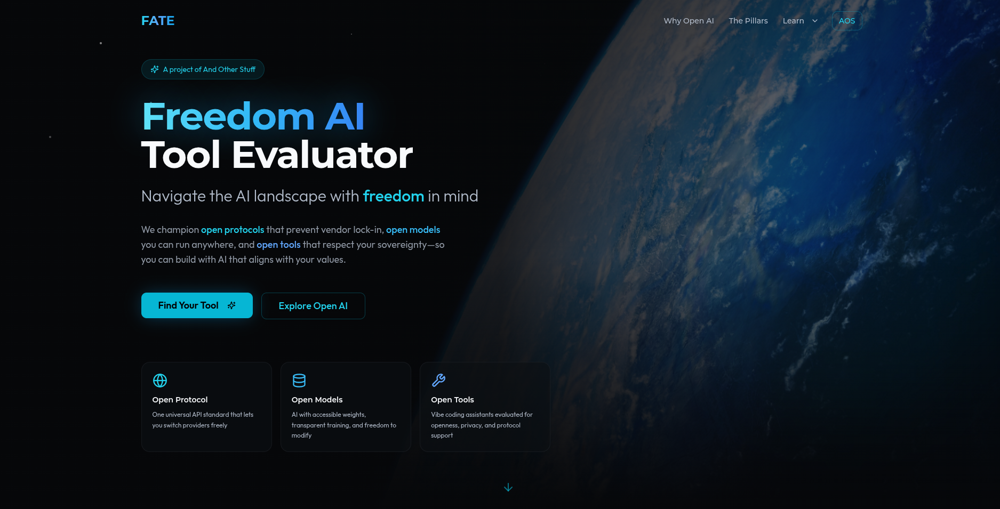

# AI Sovereignty Index

**A framework for evaluating AI protocols, models, and tools for human freedom.**

The AI Sovereignty Index champions **open protocols** that prevent vendor lock-in, **open models** you can run anywhere, and **open tools** that respect your sovereignty—so you can build with AI that aligns with your values.

## Why Open AI Matters

The word "open" gets thrown around a lot in AI marketing, but true openness means something specific: accessible weights, transparent training, and the freedom to run, modify, and share models without restriction.

Closed AI concentrates power. Open AI distributes it. The difference matters more than you think.

### The Promise—And The Peril

Artificial intelligence is transforming how we create software. "Vibe coding"—building applications through natural language conversation with AI—is making development accessible to millions who never wrote a line of code before.

But here's the critical question: **Who controls these AI tools?**

When the AI you depend on is a black box controlled by a corporation, you've traded one form of gatekeeping for another. Your creativity flows through their servers. Your ideas pass through their filters. Your sovereignty over your own tools is an illusion.

## The Three Pillars of Open AI

True freedom in AI requires openness at every layer:

### 🌐 Open Protocol

The OpenAI API specification has become the universal standard for AI inference. By building to this spec, your applications become provider-agnostic:

- **Provider Independence** — Switch between OpenAI, Anthropic, local models, and others without rewriting code
- **Self-Hosting Ready** — Run compatible models on your own infrastructure
- **Standard Authentication** — Simple Bearer token authentication works everywhere

### 🗄️ Open Models

Following the [OSI Open Source AI Definition](https://opensource.org/ai/open-source-ai-definition), truly open models provide:

- **Accessible Weights** — Download and run models on your own hardware
- **Transparent Training** — Training data and methodology are documented
- **Freedom to Modify** — Fine-tune and adapt models for your needs
- **Freedom to Redistribute** — Share your modifications with others

Featured open models include Llama, Mistral, Qwen, DeepSeek, Gemma, Phi, and more.

### 🔧 Open Tools

Compare AI coding assistants through the lens of openness, privacy, and protocol support. The evaluation rubric includes:

- Open Source (is the code auditable? can you self-host?)
- Privacy & Security (how is your data handled?)
- Open Protocol Support (can it connect to any OpenAI-compatible provider?)
- Open Model Support (can it use Llama, Mistral, Qwen, DeepSeek?)
- Decentralization (does it understand Nostr, Bitcoin, and freedom protocols?)
- Permissionless Payment (can you use it without an account? pay with Bitcoin?)
- Portability (can you take your code and data elsewhere?)
- Capabilities (full-stack or frontend only? flexible tech stack?)

## For Activists & Privacy Seekers

If you're building tools for activism, journalism, or communities under surveillance, the stakes are even higher. When your work challenges power, the tools you use can become vectors of vulnerability:

- **Data Logging** — Your prompts and creations may be stored indefinitely
- **Compelled Disclosure** — Companies can be legally forced to share your data
- **Content Refusal** — AI tools may refuse to help with "sensitive" topics
- **Account Termination** — Your account can be shut down without warning

The AI Sovereignty Index helps you find tools that respect your privacy and resist censorship.

## Take the Quiz

Not sure which tool is right for you? Take our [interactive quiz](https://ai-sovereignty.netlify.app/quiz) to get a personalized recommendation based on your values and use case.

## Resources

- [OSI Open Source AI Definition](https://opensource.org/ai/open-source-ai-definition)
- [HRF AI for Individual Rights](https://hrf.org/program/ai-for-individual-rights/)
- [GNU Free Software Definition](https://www.gnu.org/philosophy/free-sw.en.html)

## Contributing

This project is licensed under [AGPL-3.0](https://www.gnu.org/licenses/agpl-3.0.html). Contributions are welcome!

## Built With

- React 18 + TypeScript
- Tailwind CSS + shadcn/ui
- Vite
- Vibed with [MKStack](https://soapbox.pub/mkstack)

---

A project of [And Other Stuff](https://andotherstuff.org) — Technology for Human Thriving.
